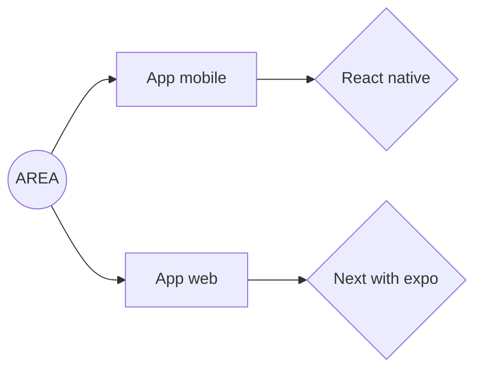
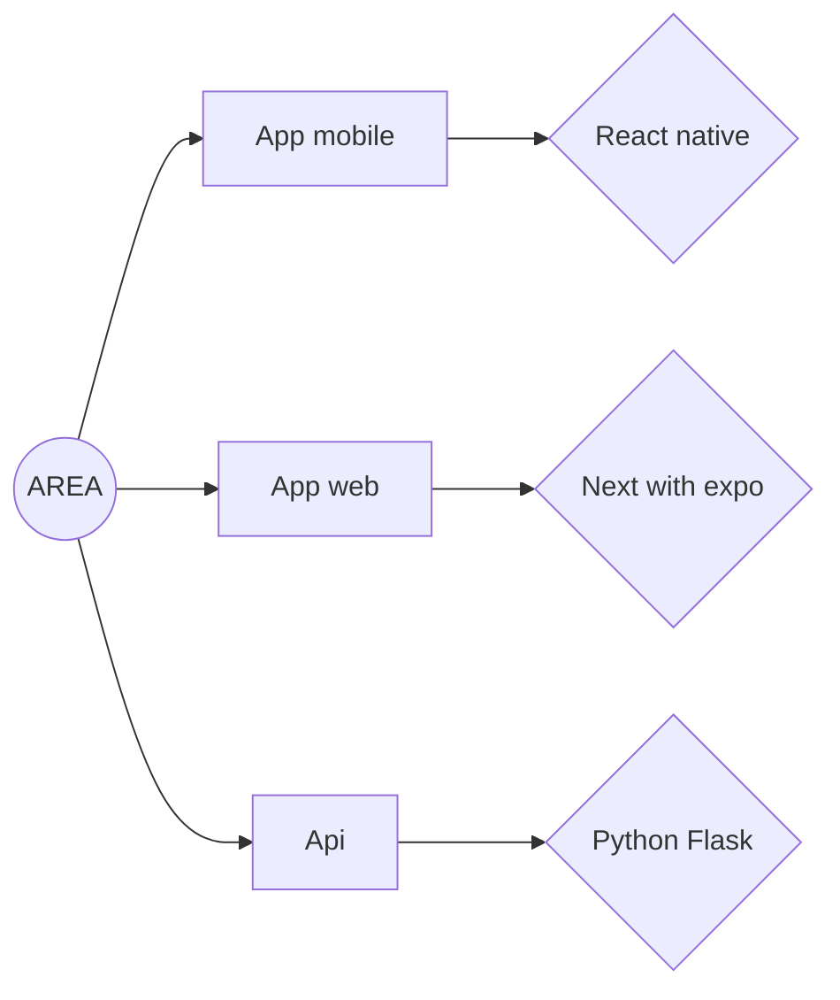

# AREA

Our app makes automation easy and effortless. In just a few clicks, connect your APIs and 
build smart workflows that run on their own. No more repetitive tasks—save time, stay 
focused on what matters, and let our platform do the work for you. The perfect tool for 
busy people who want to achieve more with less effort.

---

## Features

- REST API server
- Docker-based local development
- OAuth (GitHub)
- Secrets and API keys via environment variables
- MariaDB database support

---

## Requirements

Make sure you have:

- **Docker** → https://docs.docker.com/get-docker/
- **Docker Compose** (comes with Docker Desktop)
- **Git** (if cloning via repository)

---

## Getting Started (Local Development)

### 1 Clone the Repository

```bash
git clone <YOUR_REPOSITORY_URL>
cd <project-folder>
```

### 2 Create your .env.local
Copy the example file:
```bash
cp .env.local.example .env.local
```

Then fill in your credentials in .env.local:
You can find how to generate the required API keys here:
- Nasa -> https://api.nasa.gov/
- Discord -> https://discord.com/developers/applications 
- OpenWheather -> https://home.openweathermap.org/api_keys
- Spotify -> https://developer.spotify.com/dashboard
- Github -> https://github.com/settings/apps
- TMDB -> https://www.themoviedb.org/settings/api
- Gmail -> https://support.google.com/mail/answer/185833?hl=fr

### 3 Start the Project
To run locally:
```bash
docker compose up --build
```

To run in detached mode:
```bash
docker compose up --build -d
```

To stop everything:
```bash
docker compose down
```

## Add a new services

### 1 Add the service in the DB
Go in /server/models/service.py and add the new services with his name, description and image

### 2 Create the service
Go in /server/services and add the service you want to add

```python
from .base_service import BaseService
import requests
import os

class YOUR SERVICE(BaseService):
    name = "YOUR SERIVIVCE"

    def __init__(self):
        # Fetch the api key ...

    def get_actions(self):
        return [
        ]

    def get_reactions(self):
        return []

    def check_action(self, user, action):
        # Implement logic to check for new movie releases
        available_actions = [action["name"] for action in self.get_actions()]
        if action not in available_actions:
            print(f"Action non disponible: {action}")
            return None
        
        if action == "NAME OF THE ACTION":
            # CODE OF THE ACTION

        
        response = requests.get(full_url)
        if response.status_code != 200:
            print(f"Erreur: {response.text}")
            return None

        return {
        }

    def get_actions_output(self, action_name):
        return [
        ]
```

### API documentation
Api documentation can be found on the http://localhost:8080

### Stack Documentation

- **Front** :


- **Back** :


### Other kind of documentation
You can find some other documentation in the github repository in the documentation directory. In this directory you can fin some information about the style guide used by TriggerHub, the user journey or why we use this techno.

### Logs
For the server part you can find a logs about what append on the server in the logs directory.


### Test
For the server, their is a test policy integrated you just have to navigate to server/app.py and edit the create_app function to replace **default** by **test**.
